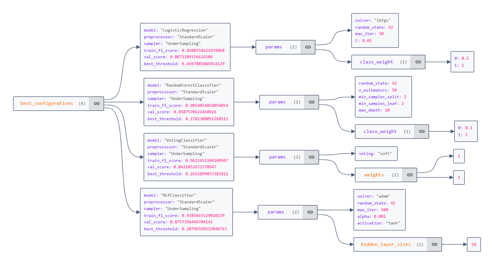

# Credit-Card-Fraud-Detection

## Project Overview 
The **Credit Card Fraud Detection** project aims to develop a machine learning model capable of detecting fraudulent credit card transactions. The project focuses on using different sampling techniques, preprocessing steps, and various classification algorithms to improve model performance. The results are evaluated based on metrics such as F1 score , with the objective of achieving high detection accuracy while minimizing false positives.

## Key Insights

1. **Class Imbalance**: The dataset shows a marked disparity between the number of fraudulent and non-fraudulent transactions. This imbalance poses a challenge for model training, as the algorithm may become biased towards the majority class. To address this, sampling techniques like oversampling the minority class and undersampling the majority class are essential to ensure balanced model learning.

2. **Feature Distributions**: Two key features, `Time` and `Amount`, exhibit significant skewness in their distributions. The `Amount` feature contains extreme outliers, while the `Time` feature shows irregular patterns across transactions. Effectively managing and transforming these features is crucial for optimizing model performance.

## Sampling Techniques

- **OverSampling**: Increases the number of minority class samples by duplicating them.
- **UnderSampling**: Reduces the number of majority class samples to balance the dataset.
- **Combination**: Combines OverSampling, UnderSampling, and SMOTE for optimal balance.

## Modeling

1. **Logistic Regression**: A simple linear model for classification.
2. **Random Forest Classifier**: A powerful ensemble model using multiple decision trees.
3. **MLP Classifier**: A multi-layer perceptron classifier, a type of neural network.
4. **Voting Classifier**: Combines predictions from multiple models to improve overall performance.

## Hyperparameter Tuning

The models were tuned by performing **Random Search** to find the best hyperparameters based on the **F1 score**. This helped in identifying the optimal settings for each model to improve its prediction accuracy.

## Model Evaluation and Results 💾

| Model                     | Training F1 Score | Validation F1 Score |
|---------------------------|-------------------|---------------------|
| Logistic Regression       | 0.81              | 0.80                |
| Random Forest Classifier  | 0.90              | 0.85                | 
| Voting Classifier         | 0.96              | 0.84                | 
| MLP Classifier            | 0.93              | 0.87                | 

## Conclusion

This project demonstrates the application of machine learning techniques to the problem of credit card fraud detection. By addressing class imbalance, tuning models, and utilizing various sampling techniques, the models achieved competitive results. Future improvements could include exploring more advanced techniques, increasing data quality, and refining hyperparameters for even better results.

